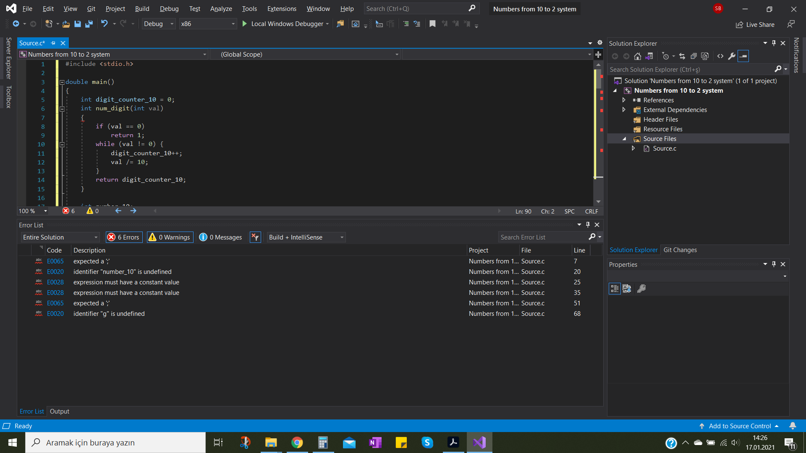
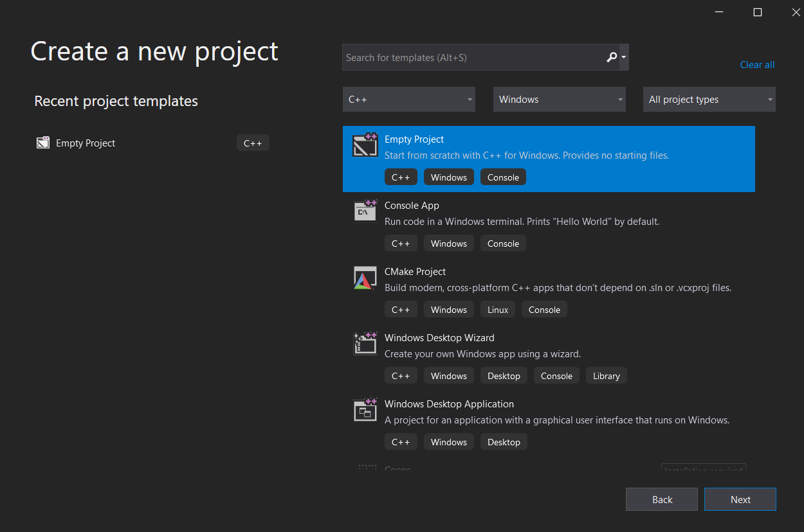
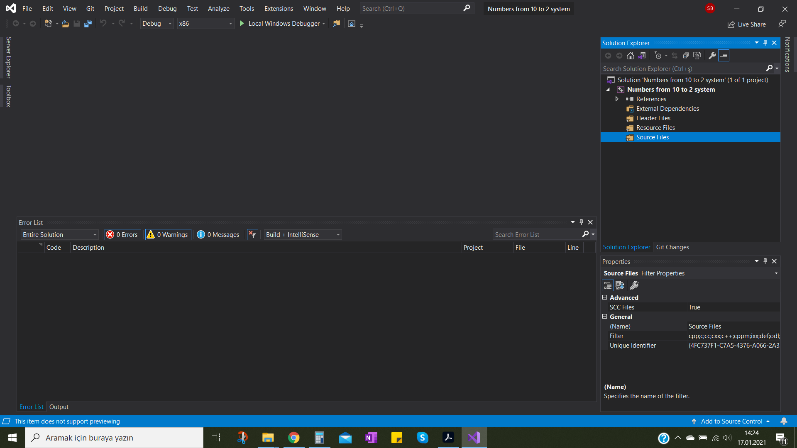
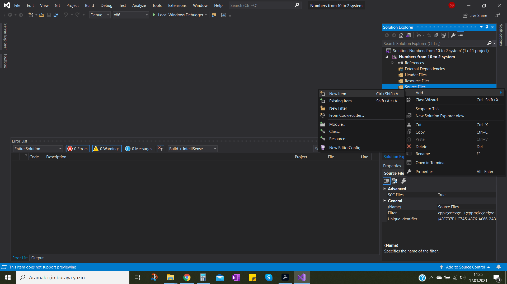
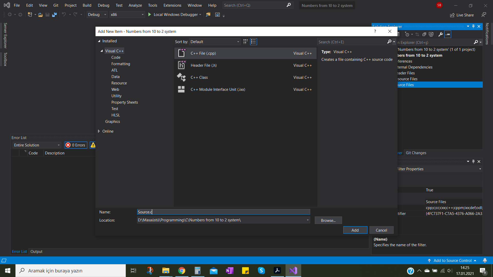
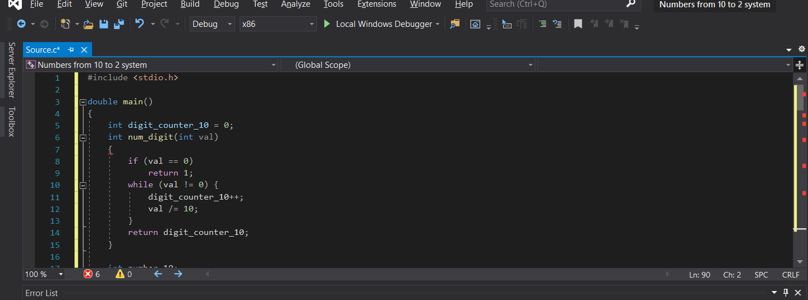

# Visual Studio-C

+ Visual Studio does not compile the .c code which can also seen in attachment. 

+ Visual studio IDE does not working when I was try with .c file extension.

+ This photo is before build.

---

helpviewer_keywords:
  - "source code"
  - ".dbg files"
  - "source code, managing"
  - "symbols, managing"
  - ".pdb files"
  - "dbg files"
  - "pdb files"
  - "debugger"
ms.assetid: 1105e169-5272-4e7c-b3e7-cda1b7798a6b
author: "mikejo5000"
ms.author: "mikejo"
manager: jillfra
ms.workload:
  - "multiple"

---

 

## Detailed photos

+ Before build

 

+ After debugging

